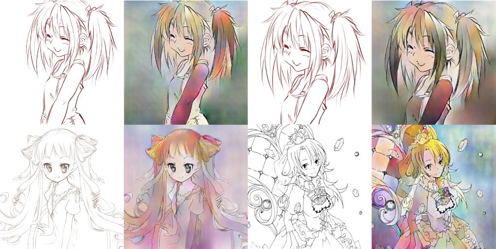

## simple implementation of pix2pix by pytorch

Original paper: [Isola, P., Zhu, J. Y., Zhou, T., & Efros, A. A. (2016). Image-to-image translation with conditional adversarial networks](https://arxiv.org/pdf/1611.07004v1.pdf). arXiv preprint arXiv:1611.07004.   [[Project Website]](https://phillipi.github.io/pix2pix/)


## Results  
Testdata（200epochs)


## Prerequisites
* PyTorch
* python 3
* OpenCV 3
* Nvidia GPU


## Usage

Download the CMP Facade Database.  
 http://cmp.felk.cvut.cz/~tylecr1/facade/CMP_facade_DB_base.zip  
(unzip ./datasets/CMP_facade_DB_base.zip)


#### Train
```
python train.py
```

#### Test
 ```
 python test.py
 ```


### 別のデータセットを使用する (例：線画着色)
* ./datasets/cnvframesEx フォルダに、着色画像ファイルとその線画画像ファイルをペアで置いてください。  
  ファイル名　着色: 00000000B.jpg 　線画: 00000000B.jpg  
  また、画像ファイルは全て縦横256×256ピクセルに統一してください。
  ```
  着色　　00000000A.jpg 　00000001A.jpg 　00000002A.jpg ...
  線画　　00000000B.jpg 　00000001B.jpg 　00000002B.jpg ...
  ```

* 使用するデータセットに合わせて、ソースファイルを修正します。今回以下に修正済みのものを用意しました。  
  訓練：  train_line.py  
  テスト： test_line.py  
  ※読み込むデータの範囲は以下の行を修正してください。
  ```
  (train_line.py:41) input_data = Dataset(data_start = 0, data_end = 999)
  (test_line.py:17)　input_data = Dataset(data_start = 1000, data_end = 1500)
  ```

* Results  
  Testdata（200epochs)
   
   このテストの訓練データはいくつかのアニメ作品での画像です。しかしながらUPにあたっては、テストはアニメでなく以下のサイトの線画作品を使用させていただきました。  
   [着色練習用線画](http://iradukai.com/nurie2.htm)  
   （左から）  [No.019] 線画提供 - ドクター博士様,	[No.024] 線画提供 - トシトキコ様 ,	[No.030] 線画提供 - ぬこ野郎様  
   画像は処理の都合上、すべて256x256にクリッピングおよびリサイズしています。絵師様すいません。

## Reference
* [junyanz/pytorch-CycleGAN-and-pix2pix](https://github.com/junyanz/pytorch-CycleGAN-and-pix2pix)
* [mrzhu-cool/pix2pix-pytorch](https://github.com/mrzhu-cool/pix2pix-pytorch)  
* [pfnet-research/chainer-pix2pix](https://github.com/pfnet-research/chainer-pix2pix)

## License
#### 　MIT

<!--
## ブログ
* http://eiji-kb.hatenablog.com/entry/2017/
-->
